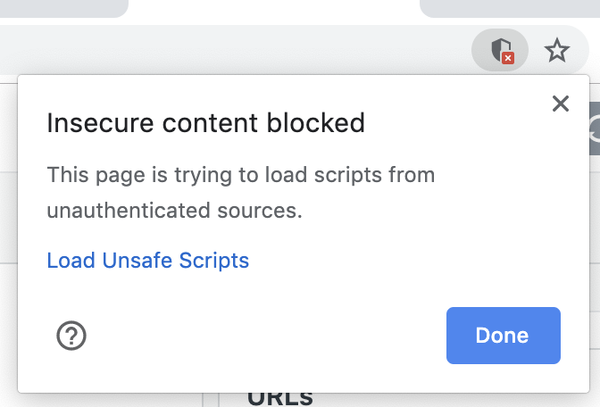
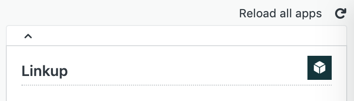

# BandLab - Zendesk Linkup

Built using [Zendesk App Tools](https://developer.zendesk.com/apps/docs/developer-guide/zat) and [Handlebars](http://handlebarsjs.com/).

URL templates are retrieved from the App Configurations, and the appropriate ticket information is extracted and inserted into the URL template.

### URL Template

To specify the URL links to be shown, use a JSON array of URLs. Each JSON object should contain the **title** of the link (to be displayed), and the **url** to open. 

```
[
  {
    'title': 'User Profile',
    'url': 'https://www.your-website.com/{{ticket.requester.email}}'
  },
  {
    'title': 'Reported Post',
    'url': 'https://www.your-website.com/post/{{ticket.customField:custom_field_name}}'
  }
]
```

Surround the variable information in double curly braces, for example `{{ticket.requester.email}}`. Context information that can be extracted is based on the Zendesk App Framework [Client API](https://developer.zendesk.com/apps/docs/core-api/client_api#client.getpaths). 


### Test in Local Environment
To test the Linkup App in a local environment, you will need to use the Zendesk App Tools. Make sure you have [installed Zendesk App Tools](https://develop.zendesk.com/hc/en-us/articles/360001075048). 


The App Configurations for local testing is defined in `settings.yml`. Once you have configured the YAML file to your preference, run the following command: 
```
zat server -c
```
The server for your Linkup App should now be running. 

Click on a ticket in your Zendesk application, and add `?zat=true` to the end of your url. For example: 
```
https://your-domain.zendesk.com/agent/tickets/123456?zat=true
```

You should see a sheild icon in your browser's address bar. Click on it and allow the loading of unsafe scripts. 


The Linkup App should be running locally for you now. Any changes made to the code base should be reflected once the Zendesk Apps are refreshed. 



### Deploying App
https://developer.zendesk.com/apps/docs/developer-guide/deploying

### Screenshot(s):

